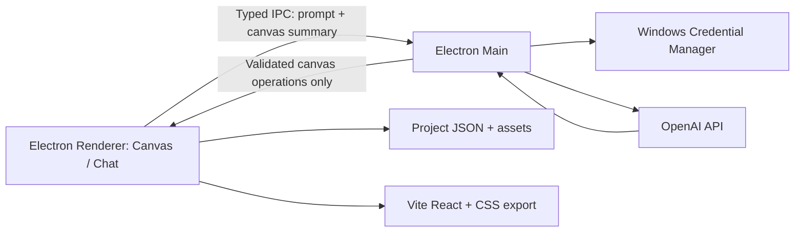
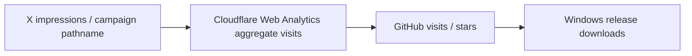

# Lay4Canvas Product Definition and Documentation Plan

> **For Hermes:** Use subagent-driven-development skill to execute this plan task-by-task. Do not resume product implementation until the documentation gate in this plan is approved.

**Goal:** 実装を凍結し、Lay4Canvasのビジョン、対象ユーザー、MVP範囲、UX、Electron構成、AI安全境界、固定viewport export、検証方法、Xでの成長戦略を、矛盾のない技術文書群として確定する。

**Architecture:** `docs/`を製品判断の正典にする。各文書に`Status: Draft / Proposed / Accepted / Superseded`を付け、重要な判断はADRへ分離する。READMEは文書indexと現在状態への短い入口にする。

**Tech Stack:** Markdown、Mermaid、既存のReact 19 + TypeScript + Vite、Electron、Windows Credential Manager、OpenAI provider adapter、構造化canvas operations、React + plain CSSによる実行可能なVite app export。

---

## 0. 作業原則

- この文書群とADRが承認されるまで、新機能実装を再開しない。
- 既存browser prototypeは検証材料であり、確定architectureではない。
- `VISION → REQUIREMENTS → SCOPE → PRODUCT DESIGN → ARCHITECTURE → VALIDATION`の順で決める。
- 一つの決定を複数文書へ複製せず、正典文書を参照する。
- FlutterFlowは内部benchmarkとしてのみ扱い、公開README、X投稿、製品コピーでは言及しない。
- deployment、Windows code signing、credential設定、外部投稿、provider課金は個別承認を得てから実行する。

## 1. 2026-09-29に確認した決定事項

### 1.1 Product

| 項目 | 決定 | 状態 |
|---|---|---|
| 中心ユーザー | AI coding agentを使う個人開発者 | Accepted |
| Product shape | 1 project = 1 page = 1 target viewport | Accepted |
| Responsive editing | MVP scope外 | Accepted。以前の3 canvas方針をSuperseded |
| Viewport presets | Desktop 1440 / Tablet 768 / Mobile 390 | Accepted |
| Canvas height | 幅固定、高さはcontentに応じて伸びる | Accepted |
| Layout | absolute-positionによる自由配置 | Accepted |
| Hierarchy | Containerがchild elementを持ち、child座標はContainer基準 | Accepted |
| Elements | Text / Button / Image / Shape / Divider / Container / Icon | Accepted |
| Common properties | x / y / width / height / z-index / rotation / opacity / visible / locked | Accepted |
| Grid | 8px | Accepted |
| Snap | 常時on、Altを押している間だけ解除 | Accepted |
| Smart guides | edge / center / 等間隔を表示してsnap | Accepted |
| Zoom / pan | mouse wheel zoom、Space + drag pan、Fit / 100% controls | Accepted |
| Multi-select / Group | Shiftでmulti-select、Ctrl+GでGroup、Groupは一括transform | Accepted |
| Copy / paste | Ctrl+C / V、app内clipboardで同一・別projectへpaste可能 | Accepted |
| Duplicate | Ctrl+D、16px右下へoffset | Accepted |
| Keyboard nudge | Arrowで1px、Shift+Arrowで8px | Accepted |
| Group export | wrapper `div`へ変換し、childはGroup基準座標 | Accepted |
| Shortcuts | Ctrl+Z/Y、S、C/V、D、G、Shift+Ctrl+G、Delete | Accepted |
| Start state | sample projectを開き、Blank projectも選択可能 | Accepted |
| Project storage | project folder内にJSONと`assets/`を置く | Accepted |
| Asset handling | project assetsへcopyし、exportへ同梱 | Accepted |
| Undo / redo | app session中のみ | Accepted |
| Autosave | 変更停止後2秒、temporary fileへ書いてatomic replace | Accepted |
| Manual save | Ctrl+Sで即時保存 | Accepted |
| Concurrent open | project folderを排他lockし、別instanceはread-only | Accepted |
| Project name | `Lay4Canvas` | Accepted。旧仮称`Visual Page Builder`をSuperseded |
| Name pronunciation | レイフォーキャンバス | Accepted |
| Name casing | 表示・package・domainで`Lay4Canvas` / `lay4canvas`へ統一 | Accepted |

### 1.2 AI and desktop runtime

| 項目 | 決定 | 状態 |
|---|---|---|
| Desktop shell | Electron | Accepted |
| Initial platform | Windows x64 | Accepted。macOS Apple Silicon方針をSuperseded |
| Distribution | GitHub Releasesのunsigned portable ZIP、install注意を明記 | Accepted |
| First provider | OpenAI | Accepted |
| Later provider | Anthropic | Accepted / Post-MVP |
| Authentication | BYOK。userのOpenAI API keyをWindows Credential Managerへ保存 | Accepted |
| Model policy | 開発・公開defaultを`gpt-5.4`に固定 | Accepted。公式確認できなかった`gpt-6-luna`案と`gpt-6-sol`案をSuperseded。snapshot IDには固定しない |
| Prompt input | textのみ | Accepted |
| Chat persistence | app session中のみ。projectへ保存しない | Accepted |
| Apply mode | AI変更を即時適用し、一操作としてundo可能 | Accepted |
| Timeout | 60秒 | Accepted |
| Retry | 自動retryなし。ユーザーが明示的に再送 | Accepted |
| Cancel | 常時可能。cancel時はoperationを一切適用しない | Accepted |
| Operation limit | 1 request最大50 operations | Accepted |
| Invalid batch | 一つでもinvalidならbatch全体をreject | Accepted |
| Model alias drift | 不適合responseはinvalid batchとして全rejectしcanvasを変更しない。自動retry・別model fallback・AI自動停止なし | Accepted |
| AI output | schema検証済みの構造化canvas operationのみ | Accepted |
| Code execution | AI生成codeや任意scriptを実行しない | Accepted |
| Repository access | なし | Accepted |
| Filesystem/shell access | project assets/export以外はなし | Accepted |
| Cost control | app側では強制せず、provider dashboardで管理 | Accepted。以前の日次/月次app上限案をSuperseded |
| Cost disclosure | Settingsへmodel IDと公式pricing確認先を表示。同意dialogやrequestごとの確認は出さない | Accepted |

### 1.3 Export

| 項目 | 決定 | 状態 |
|---|---|---|
| Output | 実行可能なVite React app一式 | Accepted |
| Styling | plain CSS | Accepted |
| Viewport guarantee | 選択したtarget viewportの固定pixel layout | Accepted |
| Other widths | 表示保証しない | Accepted |
| Assets | exportへ同梱 | Accepted |
| Responsive DOM merge | 不要 | Superseded |

### 1.4 Public growth and launch

| 項目 | 決定 | 状態 |
|---|---|---|
| North Star | `X → browser demo → GitHub → Release download` | Accepted |
| Measured funnel | X impressions / demo visits / GitHub visits・stars / release downloads | Accepted |
| Product telemetry | desktop appには入れない | Accepted |
| Browser demo | canvas操作のみ。mock AIも実APIも置かない | Accepted |
| Browser sample | Desktop 1440の架空SaaS landing page | Accepted |
| Browser export | sampleを編集し、Vite appをdownload可能 | Accepted |
| Demo hosting | Cloudflare Pagesのgenerated `*.pages.dev` URLを使用。custom domainは購入しない | Accepted。deploy自体は別承認 |
| Demo analytics | browser demoでuser consent後にCloudflare Web Analyticsを有効化。desktop telemetryは入れない | Accepted |
| Analytics retention | Cloudflare dashboardの最大6か月のみ。aggregate snapshotを別保存しない | Accepted |
| Privacy notice | 非blocking bannerで`Accept` / `Continue without analytics`を同じ強さで表示。選択前・拒否時はanalyticsを読み込まない | Accepted |
| Consent preference | analytics選択をlocalStorageへ保存し、footerからいつでも変更可能 | Accepted |
| Campaign attribution | `/from/x/<YYYYMMDD>-<short-slug>`。redirectせず同じdemoを表示し、UTM/query parameterは使わない | Accepted |
| Launch 1 | browser demo公開 | Accepted |
| Launch 2 | Electron alpha公開 | Accepted |
| X content | 15〜30秒のbefore→after動画 | Accepted |
| Cadence | 週1本の完成度が高いdemo | Accepted |
| X language | 日本語中心 | Accepted |
| README | 日本語・英語を同じ`README.md`へ併記 | Accepted |
| License | MIT、完全OSS・無料 | Accepted |
| Feedback | Discussions = 要望・作品、Issues = bug | Accepted |
| Naming | 検索可能な英数字造語 | Accepted。短い英語造語だけに限定する案をSuperseded |
| Naming deadline | browser demo公開の2週間前 | Accepted |
| Name availability | GitHub / X / npm / Cloudflare Pages project slugを確認 | Accepted |
| Naming priority | 検索時の固有性・同名競合の少なさ | Accepted |
| Naming process | 候補調査後に`Lay4Canvas`へ決定 | Completed |
| Canonical URL | MVPではCloudflare Pagesのgenerated `*.pages.dev` URLを使用。paid custom domainは取得しない | Accepted。`.com` / `.dev`購入案をSuperseded |
| X handle condition | exact match、`get<name>`、`<name>app`のいずれかを許容 | Accepted |
| npm package | unscoped `lay4canvas`を第一候補とし、登録できない場合だけ`@yuqio-dev/lay4canvas`を使用 | Accepted |
| Repository identity | public repoを`yuQio-dev/lay4canvas`、local directoryを`/home/nyanb/projects/lay4canvas`へrename | Completed 2026-09-29 |
| Benchmark structure | 段階別の定性panel。X→GitHub panelはBeads / Impeccable / Open Design、desktop OSS panelはVoicebox / World Monitor / Open Design、OpenClawはoutlier reference | Accepted |
| Public benchmark scope | 第三者projectは公開情報からlaunch hook、投稿形式、README、導線、product shapeを定性比較する。historical star総数からnumeric thresholdは作らない | Accepted。第三者Day 90 star cohort案をSuperseded |
| Own-product funnel | 自プロダクトでは`X → browser demo → GitHub → Release download`を継続して実測 | Accepted |
| Benchmark window | 過去12か月にlaunchされた個人OSS | Accepted |
| Benchmark Day 0 | canonicalな最初のpublic launch post。Lay4Canvasはbrowser demoのLaunch 1投稿 | Accepted |
| Own growth checkpoints | Lay4CanvasのGitHub総star数をD0 / D7 / D30 / D90で前向きに記録し、事前の数値目標は置かない | Accepted。第三者historical star reconstruction案とabsolute target案をSuperseded |
| Checkpoint boundary | canonical launch post timestampをD0とし、7 / 30 / 90 × 24時間後をUTCで測定 | Accepted |
| Third-party numeric thresholds | 設定しない | Accepted。25th percentile minimum、median breakout、100-star rounding案をSuperseded |
| Benchmark evidence limitation | GitHub表示star数と公開WatchEventの差が大きく、第三者Day 90総star数を再現できないため定性比較へ限定 | Accepted |

## 2. Product definition

### Vision hypothesis

**視覚的に配置した一枚のpageを、canvas内のAIと磨き、そのまま動くReact appとして持ち帰れる。**

### Problem

AI coding agentへ文章だけでUIを依頼すると、位置、階層、サイズ、視覚的な強弱が往復会話の中で曖昧になりやすい。一方、既存visual builderはhostingやruntimeへ閉じるか、AI agentとの編集体験が外付けになりやすい。

### MVP promise

- target viewportを一つ選ぶ。
- absolute canvasでpageを直接構成する。
- text promptでAIにcanvasを変更させる。
-変更は即時反映され、undoできる。
- 実行可能なReact + plain CSSのVite appをexportする。

### Explicit limitation

MVPはresponsive production site builderではない。exportは選択したtarget viewportでのみvisual fidelityを保証する。この制限をREADME、browser demo、export warningへ明記する。

## 3. Security boundary

OpenAI API keyはElectron renderer、canvas document、chat history、log、export、browser demoへ渡さない。Electron main processがWindows Credential Managerから読み、provider requestを代理する。



AIが利用できる操作:

- element作成、変更、移動、削除
- Container hierarchy変更
- property変更
- canvas全体の読み取り

AIが利用できない操作:

- repository編集
- shell command
- user home探索
- arbitrary URL fetch
- arbitrary JavaScript実行
- credential表示
- Cloudflare/GitHub操作

## 4. 作成する文書体系

```text
docs/
├── INDEX.md
├── VISION.md
├── REQUIREMENTS.md
├── SCOPE.md
├── PRODUCT_DESIGN.md
├── TECHNICAL_ARCHITECTURE.md
├── DOCUMENT_AND_EXPORT_MODEL.md
├── AI_INTEGRATION_AND_SECURITY.md
├── VALIDATION.md
├── GROWTH_AND_LAUNCH.md
├── ROADMAP.md
├── PRODUCT_BRIEF.md
├── MVP.md
└── adr/
    ├── README.md
    ├── 0001-electron-desktop-shell.md
    ├── 0002-single-viewport-fixed-layout.md
    ├── 0003-openai-key-and-operation-boundary.md
    └── 0004-vite-react-css-export.md
```

## 5. 文書作成タスク

### Task 1: Documentation index and status policy

**Files:**
- Create: `docs/INDEX.md`
- Modify: `README.md`

**Content:**

- Vision → Requirements → Scope → Product Design → Architecture → Validation → Growthの読書順。
- 各文書のstatus、owner、last reviewed。
- `Draft`は実装根拠にしない。`Accepted`だけがcontractになる。
- READMEへ文書内容を重複させない。

### Task 2: Vision and positioning

**Files:**
- Create: `docs/VISION.md`
- Modify: `docs/PRODUCT_BRIEF.md`

**Content:**

- target actorとfailed outcome。
- one-page / one-viewport product promise。
- canvas-native AIとportable Vite export。
- generic no-code SaaS、responsive builder、repository agentをanti-goalにする。
- FlutterFlow名をpublic-facing copyで使用しない。
- X上の認知とproduct usageを分離する。

### Task 3: Requirements

**Files:**
- Create: `docs/REQUIREMENTS.md`

Functional groups:

1. Project lifecycle
2. Viewport preset selection
3. Infinite-height fixed-width canvas
4. Absolute positioning and nesting
5. Element palette and properties
6. Session undo/redo
7. Local project folder and assets
8. Built-in AI chat
9. OpenAI key management
10. Preview
11. Vite app export

各要件を`REQ-F-###` / `REQ-NF-###`で採番し、priority、rationale、acceptance evidence、validation caseを持たせる。

### Task 4: Scope contract

**Files:**
- Create: `docs/SCOPE.md`
- Modify: `docs/MVP.md`

**In scope:**

- Electron Windows x64 app
- one project / one page / one viewport
- 1440 / 768 / 390 preset
- fixed width / variable height
- Text / Button / Image / Shape / Divider / Container / Icon
- nested Container hierarchy
- 8px grid、Altで一時解除できるsnap、edge / center / 等間隔smart guides
- mouse wheel zoom、Space + drag pan、Fit / 100% controls
- local project JSON + assets
- property inspector
- session undo/redo
- 2秒debounce autosave、temporary file + atomic replace、Ctrl+S
- project folder排他lock、別instanceはread-only
- text-only OpenAI canvas chat
- Windows Credential Manager credential
- deterministic preview
- executable Vite React + plain CSS export
- browser canvas demo

**Out of scope:**

- responsive editing/export
- multi-page routing
- repository editing / PR creation
- arbitrary shell/filesystem access
- arbitrary generated JavaScript execution
- backend/database/API builder
- auth/cloud sync/collaboration/billing
- hosted page publishing from desktop app
- Figma/imported website editing
- forms submission
- npm component marketplace
- image prompt
- Anthropic in first MVP
- macOS/Linux packages
- signed Windows distribution
- product telemetry

**Element property contract:**

- Common: `x / y / width / height / z-index / rotation / opacity / visible / locked`
- Text: `content / font family / size / weight / line-height / letter-spacing / color / align`
- Font source: system font + projectへimportしたlocal font。font fileをassetsへcopyし、利用権確認後にexportへ同梱
- Button: `label / href / target / background / text color / radius / border / padding`
- Image: local image、`fit / position / alt text / radius / opacity`
- Color/background: solid colorのみ
- Shape: rectangle / ellipse / line、`fill / border / radius`
- Divider: horizontal / vertical、`thickness / color / style`
- Container: `background / border / radius / single box-shadow / overflow clip` + child hierarchy
- Icon: Lucide、`color / stroke width`
- Group: wrapper `div`としてexportし、childはGroup基準のrelative geometryを保持

### Task 5: Product design specification

**Files:**
- Create: `docs/PRODUCT_DESIGN.md`

Required flows:

1. Open sample / create blank project
2. Choose Desktop / Tablet / Mobile target
3. Add/select/move/resize/nest element
4. Snap to 8px grid and smart guides; temporarily bypass snap with Alt
5. Zoom with mouse wheel, pan with Space + drag, restore Fit / 100%
6. Multi-select、Group / Ungroup、copy / paste、duplicate、keyboard nudge
7. Configure property, local asset, system/local font
8. Confirm local font usage rights before export bundling
9. Ask AI to change canvas
10. See immediate result and undo
11. Cancel an in-flight request without partial apply
12. Preview at exact target width
13. Export Vite app
14. Configure/delete OpenAI key
15. Save immediately with Ctrl+S
16. Open a locked project read-only in another instance
17. Recover from failed AI request or invalid operation

Required screen regions:

- project top bar
- element library
- canvas/rulers/guides
- layers tree
- inspector
- AI chat
- preview/export
- provider settings

Required states:

- sample project
- blank project
- generating
- canceled request
- invalid operation
- invalid key
- provider unavailable
- export failure
- missing asset
- crash recovery
- offline mode

### Task 6: Electron architecture ADR

**Files:**
- Create: `docs/TECHNICAL_ARCHITECTURE.md`
- Create: `docs/adr/0001-electron-desktop-shell.md`

Specify:

- renderer / preload / main process separation
- `contextIsolation: true`
- Node integration disabled in renderer
- typed IPC allowlist
- Windows Credential Manager adapter
- provider adapter
- canvas operation validator
- project store
- exporter
- preview isolation
- Windows x64 build
- unsigned portable ZIP packaging
- SHA-256 checksum generation
- release README bundling
- release README冒頭でunsignedを明記する。
- SHA-256照合後に限り、SmartScreenの「詳細情報」から実行する手順を案内する。
- SmartScreenやWindows security機能を全体無効化する手順は掲載しない。

### Task 7: Document and export model

**Files:**
- Create: `docs/DOCUMENT_AND_EXPORT_MODEL.md`
- Create: `docs/adr/0002-single-viewport-fixed-layout.md`
- Create: `docs/adr/0004-vite-react-css-export.md`

Specify:

- schema version
- target viewport preset
- canvas width and document height
- element ID/type/content/geometry/style/z-index
- parent Container ID and relative coordinates
- Group wrapper ID and group-relative child coordinates
- asset references
- local font asset、license confirmation metadata、export bundling rule
- accessibility fields
- deterministic ordering
- unknown-field handling
- migration policy
- project directory tree
- two-second autosave debounce
- temporary-file write followed by atomic `project.json` replace
- Ctrl+S immediate save
- project lock metadata and read-only fallback
- export directory tree
- generated React component boundaries
- CSS naming strategy
- fixed viewport warning
- visual fidelity acceptance test
- asset-copy verification

Example project tree:

```text
my-project/
├── project.json
└── assets/
    ├── hero.webp
    └── icon.svg
```

Example export tree:

```text
exported-app/
├── package.json
├── index.html
├── src/
│   ├── App.tsx
│   ├── page.css
│   └── assets/
└── vite.config.ts
```

### Task 8: AI integration and security

**Files:**
- Create: `docs/AI_INTEGRATION_AND_SECURITY.md`
- Create: `docs/adr/0003-openai-key-and-operation-boundary.md`

Specify:

- raw keyはWindows Credential Manager以外へ永続化しない。
- rendererはkeyの存在状態だけを受け取る。
- OpenAIをfirst providerとし、Anthropic adapterはpost-MVP。
- API keyはBYOKとする。
- 開発・公開default model IDを`gpt-5.4`に固定する。
- `gpt-6-luna`はOpenAI公式model catalogで確認できなかったため採用しない。
- model snapshotは固定しない。alias更新によるbehavior driftをvalidation suiteで検出する。
- alias drift等でresponseがschema不適合の場合はinvalid batchとして全rejectし、canvasを変更しない。
- 自動retry、別modelへのfallback、連続失敗によるAI自動停止は行わない。
- chat historyはsession-only。
- responseをcanvas operation schemaへ変換し、validation後に一括適用する。
- AI適用単位を一つのundo frameにする。
- 60秒でtimeoutする。
- 自動retryは行わず、ユーザーが明示再送する。
- 常にCancel可能で、cancel時はoperationを一切適用しない。
- 一度のresponseは最大50 operationsとする。
- 一つでもinvalid operationがあればbatch全体をrejectする。
- prompt/document/keyをlogへ残さない方針。
- app側cost limitは実装せず、provider dashboardへの導線を用意する。
- Settingsへ現在のmodel IDとOpenAI公式pricing確認先を表示する。
- cost同意dialogやrequestごとの確認は表示しない。

Threat model:

- credential exfiltration
- IPC abuse
- prompt injection from element text
- malformed/oversized operation
- deletion of large canvas subtree
- provider outage
- accidental secret in logs/export
- unbounded request loop

### Task 9: Validation

**Files:**
- Create: `docs/VALIDATION.md`

Core task:

1. sample projectを確認する。
2. Blank projectを作る。
3. target viewportを選ぶ。
4. Text、Image、Button、Containerを配置する。
5. AIへ一つの変更を依頼する。
6. undoして再適用する。
7. Vite appをexportする。
8. `npm install && npm run build`を通す。
9. target widthでsource canvasとexport screenshotを比較する。

Metrics:

- time to first element
- task completion
- AI operation success
- undo recovery
- export success
- missing assets
- screenshot visual difference
- keyboard completion
- accessibility violations
- unexpected network/filesystem access
- clarification count

Go/no-go thresholdsは3〜5人のpilotとbenchmark後に決める。

### Task 10: X growth and launch

**Files:**
- Create: `docs/GROWTH_AND_LAUNCH.md`

Measured funnel:



Launch sequence:

1. 週1本の高品質before/after demo。
- 各X投稿に`/from/x/<YYYYMMDD>-<short-slug>`形式のdemo URLを設定する。redirectせず同じdemoを表示し、UTM/query parameterは使用しない。
3. browser demo公開でLaunch 1。
4. GitHub Discussionsで作品・要望を受ける。
5. Issuesはbugへ限定する。
6. Electron alpha公開でLaunch 2。
7. release downloadとGitHub growthを比較する。

Public assets:

- 日本語中心のX動画/post
- 日英併記README
- Cloudflare Pagesのgenerated `*.pages.dev` URLで提供するcanvas-only demo。Desktop 1440の架空SaaS landing pageを初期sampleにし、custom domainは購入しない
- browser demoで初回privacy noticeを表示し、明示同意が得られるまでCloudflare Web Analytics scriptを読み込まない
- noticeは非blocking bannerとし、`Accept`と`Continue without analytics`を同じvisual priorityで表示する
- demo機能は未選択・拒否時も制限せず、consent preferenceだけをlocalStorageへ保存する
- footerのprivacy settingsから選択を変更可能にする
- Cloudflare dashboardの最大6か月だけを利用し、aggregate snapshotを別保存しない
- Cloudflare Web Analytics自体はcookie、localStorage、fingerprinting、個人識別情報を使用しない
- browser demoから編集済みVite appをdownload可能にする
- GitHub Releaseのunsigned Windows x64 portable ZIP、SHA-256 checksum、README
- install warning
- MIT license

Benchmark:

- X→GitHub panel: Beads / Impeccable / Open Design。
- Desktop OSS panel: Voicebox / World Monitor / Open Design。
- OpenClawはcore cohortへ含めず、outlier referenceとして扱う。
- Day 0はcanonicalな最初のpublic launch postとする。Lay4Canvasはbrowser demoのLaunch 1投稿をDay 0とする。
- 第三者projectはlaunch hook、投稿形式、README、導線、product shapeを公開情報から定性比較する。
- 第三者projectのdemo visits、release downloads、推定conversionは比較しない。
- 自プロダクトでは`X → browser demo → GitHub → Release download`の完全funnelを計測する。
- GitHub表示star数と公開WatchEventから再現できるactor数の差が大きいため、第三者historical star総数からnumeric thresholdは算出しない。
- Lay4Canvas自身のGitHub総star数をD0 / D7 / D30 / D90で前向きに記録し、事前のminimum / breakout数値は設定しない。
- D0はcanonical launch post timestamp、D7 / D30 / D90はそこから正確に7 / 30 / 90 × 24時間後とし、UTCで測定する。
- 第三者cohortの25th percentile minimum、median breakout、100-star rounding案はSupersededとする。

### Task 11: Roadmap and ADR index

**Files:**
- Create: `docs/ROADMAP.md`
- Create: `docs/adr/README.md`

Phase order:

1. Documentation freeze
2. Electron/Windows Credential Manager security spike
3. Single-viewport schema and export spike
4. Canvas hierarchy core
5. OpenAI operation protocol
6. Vite export vertical slice
7. Browser demo extraction
8. Usability pilot
9. Naming
10. Launch 1
11. Electron packaging
12. Launch 2

No implementation until these are Accepted:

- `VISION.md`
- `REQUIREMENTS.md`
- `SCOPE.md`
- ADR-0001 Electron
- ADR-0002 single viewport
- ADR-0003 OpenAI/key boundary
- ADR-0004 export contract

### Task 12: Consistency review

**Files:**
- Modify: `README.md`
- Modify: `AGENTS.md`
- Modify: `docs/PRODUCT_BRIEF.md`
- Modify: `docs/MVP.md`
- Review: all `docs/**/*.md`

Remove stale claims:

- browser-only product
- responsive/multi-breakpoint editor
- three canvas merge
- repository-first agent handoff as the primary interaction
- agent brief as the main AI integration
- source export as a future-only feature
- FlutterFlow mention in public-facing copy
- product telemetry or activation-event tracking

Verification:

```bash
npx --yes markdown-link-check README.md docs/*.md docs/adr/*.md
npm test
npm run lint
npm run build
git diff --check
```

Expected:

- broken links: 0
- contradictory active decisions: 0
- tests/lint/build: success
- documentation phase中のsource behavior変更: 0

## 6. Remaining verify questions

blocking verify questionは解消済み。

- paid custom domainは購入せず、MVP browser demoにはCloudflare Pagesのgenerated `*.pages.dev` URLを使用する。
- X handle取得、npm publish、Cloudflare Pages deployは外部状態・公開を伴うため、実行前に個別承認を得る。


## 7. Definition of Done

Documentation phaseは次を満たして完了する。

- 上記文書がすべて存在する。
- 重要決定にstatus、理由、trade-offがある。
- Must要件にvalidation caseが紐づく。
- one-project / one-viewport scopeが全資料で一致する。
- Electron IPCとKeychain境界がMermaidで示される。
- AI tool permissionと禁止操作が明文化される。
- Vite React + plain CSS export contractがAcceptedになる。
- X→demo→GitHub→downloadの測定項目が定義される。
- READMEとAGENTSが正典文書を参照する。
- userが`VISION`、`SCOPE`、4件のADRを明示承認する。
- gate通過前に新機能実装を開始していない。
